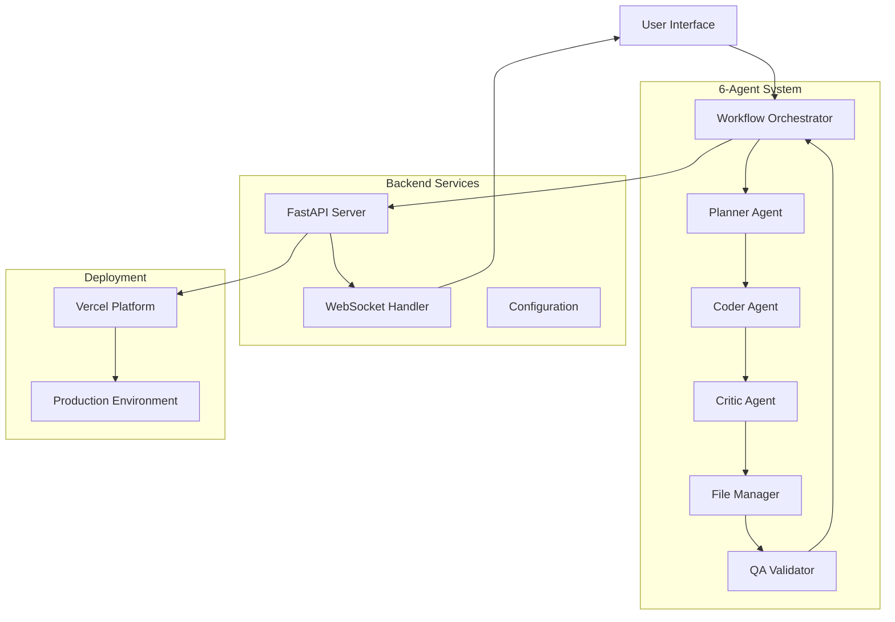

# Multi-Agent Code Generation System

[](https://opensource.org/licenses/MIT)
[](https://www.python.org/downloads/)
[](https://fastapi.tiangolo.com/)
[](https://vercel.com)
[](#6-agent-workflow-architecture)

## 🎯 Project Overview

The **Multi-Agent Code Generation System** is a sophisticated AI-powered platform that leverages 6 specialized agents to automatically generate, review, and validate complete software projects. Built with production-grade architecture, the system combines FastAPI backend services with real-time WebSocket communication, comprehensive QA validation, and seamless Vercel deployment.

### Core Capabilities
- **Intelligent Code Generation**: Create complete projects from natural language prompts
- **6-Agent Orchestration**: Specialized agents for planning, coding, reviewing, organizing, and validating
- **Real-time Monitoring**: WebSocket-based progress tracking and updates
- **Quality Assurance**: Comprehensive testing, security scanning, and performance analysis
- **Multi-Framework Support**: React TypeScript, Vue.js, Vanilla HTML/CSS/JS
- **Production Deployment**: Automated Vercel deployment with health monitoring

## 🏗️ Architecture Overview



## 📁 Complete Project Structure

```
/workspace/
├── 📁 agents/                          # 6-Agent System Core
│   ├── 🤖 vibe_workflow_orchestrator_agent.py  # Master coordinator (797 lines)
│   ├── 📋 vibe_planner_agent.py               # Project planning specialist (277 lines)
│   ├── 💻 vibe_coder_agent.py                 # Code generation engine (652 lines)
│   ├── 🔍 vibe_critic_agent.py                # Code review and quality (862 lines)
│   ├── 📂 vibe_file_manager_agent.py          # File organization (716 lines)
│   ├── ✅ vibe_qa_validator_agent.py          # QA testing and validation (705 lines)
│   ├── 🏗️ vibe_base_agent.py                  # Base agent functionality (161 lines)
│   └── 🔧 base_agent.py                       # Core agent infrastructure (1153 lines)
│
├── 📁 backend/                         # FastAPI Backend Services
│   ├── 🚀 simple_app.py               # Main FastAPI application (742 lines)
│   ├── 🔌 simple_backend.py           # Simplified backend server (159 lines)
│   ├── 🔗 vibe_backend_integration.py # Agent integration layer (305 lines)
│   ├── 📁 core/                       # Core backend modules
│   ├── 📁 api/                        # API route definitions
│   ├── 📁 models/                     # Data models and schemas
│   ├── 📁 orchestrator/               # Agent coordination services
│   ├── 📁 grpc/                       # gRPC communication
│   └── 📁 monitoring/                 # Health checks and metrics
│
├── 📁 api/                            # Vercel API Endpoints
│   ├── 🌐 index.py                    # Main API entry point (154 lines)
│   ├── 🎨 generate.py                 # Code generation endpoint (180 lines)
│   ├── 📱 vercel_app.py               # Vercel application wrapper (438 lines)
│   ├── 🔌 websocket_handler.py        # Real-time communication (460 lines)
│   ├── 📁 auth/                       # Authentication endpoints
│   ├── 📁 download/                   # Project download handlers
│   ├── 📁 files/                      # File management endpoints
│   └── 📁 status/                     # Status monitoring endpoints
│
├── 📁 frontend/                       # User Interface
│   ├── 🎨 enhanced_vibe_frontend.html # Main UI (1703 lines)
│   ├── 🧪 test_vibe_integration.html  # Testing interface (493 lines)
│   └── 📁 pages/                      # Additional UI pages
│
├── 📁 config/                         # System Configuration
│   ├── ⚙️ config.py                   # Settings management (194 lines)
│   ├── 🔒 security.py                # Security configurations
│   └── 📄 config.json                # Runtime configurations
│
├── 📁 tests/                          # Testing Suite
│   ├── 🧪 test_6_agent_integration.py # 6-agent system tests (452 lines)
│   ├── 🔄 test_system_integration.py  # System integration tests
│   ├── 🌐 test_api_completeness.py    # API endpoint testing
│   ├── 🤝 test_agent_coordination.py  # Agent coordination tests
│   └── 🖥️ backend.test.py             # Backend functionality tests
│
├── 📁 deployment/                     # Deployment Configuration
│   ├── 🐳 docker-compose.prod.yml     # Production Docker setup
│   ├── ☸️ k8s/                        # Kubernetes configurations
│   └── 🚀 scripts/                    # Deployment automation
│
├── 📁 monitoring/                     # System Monitoring
│   ├── 📊 health_checks.py           # Health monitoring
│   ├── 📈 metrics.py                 # Performance metrics
│   └── 🚨 alerts.py                  # Alert management
│
├── 📋 Entry Points & Configuration
│   ├── 🚀 main.py                     # Primary application entry (28 lines)
│   ├── 🤗 app.py                      # Hugging Face Spaces entry (192 lines)
│   ├── ⚙️ vercel.json                 # Vercel deployment config (164 lines)
│   ├── 📦 package.json                # Node.js dependencies (80 lines)
│   ├── 🐍 requirements.txt            # Python dependencies
│   └── 🔧 runtime.txt                 # Python runtime version
│
└── 📁 generated_projects/             # Output Directory
    └── 💾 [Generated project files]   # User-generated projects
```

## 🤖 Agent System Documentation

### 6-Agent Workflow Architecture

The system employs 6 specialized AI agents that work in coordination to deliver high-quality code generation:

#### 1. **Workflow Orchestrator Agent** (`vibe_workflow_orchestrator_agent.py`)
- **Role**: Master coordinator and execution manager
- **Responsibilities**: 
  - Manages the entire 6-agent workflow execution
  - Coordinates inter-agent communication and data flow
  - Handles real-time WebSocket progress updates
  - Manages error handling and recovery procedures
  - Tracks execution metrics and performance
- **Key Features**:
  - Asynchronous agent coordination
  - Real-time progress callbacks
  - Comprehensive error logging
  - Workflow state management
  - Quality gate enforcement

#### 2. **Project Planner Agent** (`vibe_planner_agent.py`)
- **Role**: Technical requirements analysis and project planning
- **Responsibilities**:
  - Analyzes natural language prompts using pattern matching
  - Creates comprehensive technical implementation plans
  - Identifies project type, framework, and features
  - Generates architecture recommendations
  - Defines component structure and dependencies
- **Key Features**:
  - UI pattern recognition (modern, dark, colorful, professional)
  - Project type detection (dashboard, blog, portfolio, landing, app)
  - Technology stack recommendations
  - Feature requirement analysis

#### 3. **Code Generation Agent** (`vibe_coder_agent.py`)
- **Role**: Actual code file generation and implementation
- **Responsibilities**:
  - Generates complete project code from technical plans
  - Creates component structures and implementations
  - Handles multiple framework support (React TypeScript, Vue, Vanilla)
  - Implements styling and responsive design
  - Generates package.json and configuration files
- **Key Features**:
  - Multi-framework template system
  - TypeScript support with proper type definitions
  - Responsive design implementation
  - Modern UI component generation
  - Configuration file generation

#### 4. **Code Review Agent** (`vibe_critic_agent.py`)
- **Role**: Code quality analysis and best practices enforcement
- **Responsibilities**:
  - Reviews generated code for quality and standards compliance
  - Validates TypeScript type safety and interfaces
  - Checks accessibility and performance standards
  - Ensures architectural best practices
  - Provides improvement recommendations
- **Key Features**:
  - TypeScript validation (type safety, interfaces, imports)
  - Styling consistency checks (responsive design, accessibility)
  - Architecture analysis (component separation, reusability)
  - Performance optimization recommendations
  - Security best practices validation

#### 5. **File Management Agent** (`vibe_file_manager_agent.py`)
- **Role**: Project structure organization and file management
- **Responsibilities**:
  - Creates proper directory structures for different frameworks
  - Organizes files according to best practices
  - Manages project dependencies and configurations
  - Handles file relationships and imports
  - Generates proper project scaffolding
- **Key Features**:
  - Framework-specific directory structures
  - Dependency management
  - Import resolution and organization
  - Configuration file placement
  - Project metadata generation

#### 6. **QA Validation Agent** (`vibe_qa_validator_agent.py`)
- **Role**: Comprehensive testing and quality assurance
- **Responsibilities**:
  - Performs code compilation validation
  - Executes functional testing (unit, integration, e2e)
  - Conducts security vulnerability scanning
  - Analyzes performance metrics
  - Calculates quality scores and provides final approval
- **Key Features**:
  - Multi-language testing framework support
  - Security scanning with vulnerability detection
  - Performance analysis and optimization
  - Quality score calculation (minimum 85% threshold)
  - Final project approval workflow

## 🎨 Frontend Components

### Main Interface (`enhanced_vibe_frontend.html`)
- **Modern UI Design**: Clean, responsive interface with dark/light mode support
- **Real-time Progress**: Live agent progress tracking with WebSocket updates
- **Code Preview**: Syntax-highlighted code preview with file navigation
- **Download Management**: Automatic project packaging and download
- **Error Handling**: Comprehensive error display and recovery options

### Key UI Features:
- **Agent Dashboard**: Visual representation of 6-agent workflow progress
- **Project Configuration**: Framework selection, feature toggles, complexity settings
- **Real-time Monitoring**: Live updates from backend agents via WebSocket
- **Quality Metrics**: QA validation results, quality scores, and approval status
- **Download Center**: ZIP file generation and project export

## ⚙️ Backend Services

### FastAPI Application (`simple_app.py`)
- **Production-ready FastAPI server** with comprehensive middleware
- **Real-time WebSocket support** for agent progress updates
- **6-agent orchestration** with enhanced progress tracking
- **QA validation integration** with detailed reporting
- **Health monitoring** and system statistics

### Key API Endpoints:

#### Core Generation Endpoints:
- `POST /api/vibe-coding` - Start new project generation
- `GET /api/vibe-coding/status/{job_id}` - Get generation status
- `GET /api/vibe-coding/detailed-status/{job_id}` - Comprehensive status with QA metrics
- `GET /api/vibe-coding/qa-report/{job_id}` - Detailed QA validation report

#### File Management:
- `GET /api/vibe-coding/files/{job_id}` - List generated project files
- `GET /api/download/{job_id}` - Download project as ZIP

#### System Monitoring:
- `GET /health` - System health check
- `GET /api/stats` - System statistics and metrics
- `GET /api/projects` - List all projects with pagination

#### WebSocket Communication:
- `WS /ws/{job_id}` - Real-time project updates and progress

### WebSocket Message Types:
- `initial_status` - Current job status on connection
- `agent_progress` - Individual agent progress updates
- `workflow_status` - Overall workflow status changes
- `qa_metrics` - Quality assurance metrics updates
- `project_complete` - Final completion notification
- `error` - Error notifications and details

## 🔄 Development Workflow

### Git Workflow and Branch Management

#### Branch Strategy:
```bash
main                    # Production-ready code
├── develop            # Integration branch
├── feature/*          # Feature development
├── hotfix/*           # Production fixes
└── release/*          # Release preparation
```

#### Safe Merge Procedures:
```bash
# 1. Feature Development
git checkout -b feature/agent-enhancement
git add . && git commit -m "feat: enhance QA validation agent"
git push origin feature/agent-enhancement

# 2. Code Review and Testing
# Create PR → Review → Automated tests → Approval

# 3. Safe Merge to Main
git checkout main
git pull origin main
git merge --no-ff feature/agent-enhancement
git push origin main

# 4. Cleanup
git branch -d feature/agent-enhancement
git push origin --delete feature/agent-enhancement
```

#### Deployment Process:
1. **Development**: Feature branches → develop branch
2. **Testing**: Automated tests and QA validation
3. **Staging**: Deploy to staging environment for validation
4. **Production**: Merge to main → Automatic Vercel deployment

## 🚀 Execution Flow & Entry Points

### System Startup Procedures

#### 1. **Main Application Entry Points**

##### Primary Entry Point (`main.py`):
```python
# Production server startup with uvicorn
uvicorn.run(
    "backend.core.app:app",
    host=settings.server_host,
    port=settings.server_port,
    reload=settings.server_reload,
    workers=settings.server_workers
)
```

##### Hugging Face Spaces Entry (`app.py`):
```python
# Gradio interface for HF Spaces deployment
def main():
    demo = setup_gradio_interface()
    demo.launch(server_name="0.0.0.0", server_port=7860)
```

##### Vercel API Entry (`api/index.py`):
```python
# Vercel serverless function entry
app = FastAPI(title="Multi-Agent Code Generation API")
# Routes handled via vercel.json configuration
```

#### 2. **Development Server Startup**
```bash
# Backend Development Server
cd /workspace
python main.py
# Starts FastAPI server on http://localhost:8000

# Alternative: Direct FastAPI
uvicorn backend.simple_app:app --host 0.0.0.0 --port 8000 --reload

# Frontend Development (if using Next.js)
npm run dev
# Starts Next.js server on http://localhost:3000
```

#### 3. **Production Deployment Flow**
```bash
# Vercel Production Deployment
vercel --prod
# Automatic deployment triggered by:
# - Push to main branch
# - Manual deployment via Vercel CLI
# - GitHub Actions workflow

# Health Check Verification
curl https://your-app.vercel.app/health
# Returns: {"status": "healthy", "agents_ready": true}
```

#### 4. **Agent Initialization Sequence**

```python
# 1. Orchestrator Agent Startup
orchestrator_agent = VibeWorkflowOrchestratorAgent(
    progress_callback=orchestrator_progress_callback
)

# 2. Agent Pool Initialization
self.agents = {
    "planner": VibePlannerAgent(),
    "coder": VibeCoderAgent(), 
    "critic": VibeCriticAgent(),
    "file_manager": VibeFileManagerAgent(),
    "qa_validator": VibeQAValidatorAgent()
}

# 3. Service Discovery and Health Checks
for agent_name, agent in self.agents.items():
    await agent.initialize()
    await agent.health_check()
```

#### 5. **WebSocket Connection Flow**
```javascript
// Client-side WebSocket connection
const websocket = new WebSocket(`wss://your-app.vercel.app/ws/${jobId}`);

websocket.onopen = () => {
    // Send ping for connection health
    websocket.send(JSON.stringify({"type": "ping"}));
};

websocket.onmessage = (event) => {
    const data = JSON.parse(event.data);
    // Handle agent progress updates
    updateUI(data);
};
```

### File Execution Order & Dependencies

#### **Primary Entry Points**:

1. **`main.py`** - Main application startup
   - Loads configuration from `config/config.py`
   - Initializes FastAPI application from `backend.core.app`
   - Starts uvicorn server with production settings

2. **`backend/simple_app.py`** - FastAPI server initialization
   - Sets up CORS middleware and security headers
   - Initializes 6-agent orchestrator system
   - Configures WebSocket communication handlers
   - Defines all API endpoints and routing

3. **`app.py`** - Hugging Face Spaces entry point
   - Creates Gradio interface for HF deployment
   - Integrates with backend agent system
   - Provides alternative UI for different platforms

4. **`api/index.py`** - Vercel serverless entry
   - Configures FastAPI for serverless deployment
   - Handles Vercel-specific routing and optimization
   - Manages cold start and performance optimization

5. **`frontend/enhanced_vibe_frontend.html`** - Main UI entry
   - Standalone HTML interface with WebSocket integration
   - Real-time agent progress visualization
   - Project generation and download management

#### **Agent System Initialization**:

1. **`agents/base_agent.py`** - Base agent infrastructure
   - Provides common agent functionality and interfaces
   - Handles OpenAI API communication
   - Implements error handling and retry logic

2. **`agents/vibe_workflow_orchestrator_agent.py`** - Orchestrator startup
   - Initializes all 6 specialized agents
   - Sets up inter-agent communication channels
   - Manages workflow state and coordination

3. **Agent Pool Initialization Order**:
   ```python
   # Sequential agent initialization
   1. VibePlannerAgent()        # Project planning
   2. VibeCoderAgent()          # Code generation  
   3. VibeCriticAgent()         # Code review
   4. VibeFileManagerAgent()    # File organization
   5. VibeQAValidatorAgent()    # Quality assurance
   6. WebSocket integration     # Real-time updates
   ```

#### **Service Dependencies & Startup Order**:

1. **Configuration Loading**: `config/config.py`
   - Environment variables validation
   - OpenAI API key verification
   - System settings initialization

2. **Database Connections**: Not applicable (stateless system)
   - In-memory job tracking
   - Temporary file management

3. **gRPC Service Registration**: `backend/grpc/`
   - Agent communication protocols
   - Service discovery mechanisms

4. **WebSocket Server Initialization**: `api/websocket_handler.py`
   - Connection manager setup
   - Real-time communication channels
   - Agent progress broadcasting

5. **Agent Pool Creation**: `agents/`
   - Individual agent initialization
   - Health checks and capability verification
   - Inter-agent communication setup

### Development Environment Setup

```bash
# Complete Development Environment Setup

# 1. Clone and Navigate
git clone <repository-url>
cd multi-agent-code-generation-system

# 2. Python Environment Setup
python -m venv venv
source venv/bin/activate  # Linux/Mac
# venv\Scripts\activate   # Windows

# 3. Install Python Dependencies
pip install -r requirements.txt
pip install -r requirements-dev.txt

# 4. Environment Variables
cp .env.example .env
# Configure OPENAI_API_KEY and other settings

# 5. Node.js Dependencies (if using Next.js features)
npm install

# 6. Start Development Servers

# Backend Server (Primary)
python main.py
# Runs on http://localhost:8000

# Alternative: Direct FastAPI
uvicorn backend.simple_app:app --reload --host 0.0.0.0 --port 8000

# Frontend (if using Next.js)
npm run dev
# Runs on http://localhost:3000

# 7. Verify Installation
curl http://localhost:8000/health
# Should return: {"status": "healthy", "agents_ready": true}

# 8. Run Tests
python -m pytest tests/
npm test
```

### Production Deployment Flow

```bash
# Production Startup Sequence

# 1. Vercel Deployment
vercel --prod
# Automatic deployment from main branch

# 2. Environment Verification
# Production environment variables:
ENVIRONMENT=production
DEBUG=false
OPENAI_API_KEY=<production-key>
NODE_ENV=production

# 3. Health Check Endpoints
curl https://your-app.vercel.app/health
# Returns system health status

curl https://your-app.vercel.app/api/stats
# Returns system statistics

# 4. Service Monitoring
# Automatic monitoring via Vercel dashboard
# Custom health checks every 6 hours via cron

# 5. Performance Optimization
# - Cold start optimization for serverless functions
# - WebSocket connection pooling
# - Agent response caching
# - Resource cleanup procedures
```

## 📚 API Documentation

### Core API Endpoints

#### Project Generation
```http
POST /api/vibe-coding
Content-Type: application/json

{
  "prompt": "Create a modern React dashboard with dark mode",
  "project_type": "web",
  "framework": "react",
  "complexity": "intermediate",
  "features": ["dark-mode", "responsive-design", "testing"]
}

Response:
{
  "job_id": "uuid",
  "status": "started",
  "message": "6-agent project generation started successfully",
  "estimated_time": 400,
  "websocket_url": "wss://app.vercel.app/ws/uuid"
}
```

#### Status Monitoring
```http
GET /api/vibe-coding/detailed-status/{job_id}

Response:
{
  "job_id": "uuid",
  "status": "processing",
  "progress": 65.5,
  "current_phase": "QA validation in progress",
  "agents": {
    "orchestrator": {"status": "completed", "progress": 100},
    "planner": {"status": "completed", "progress": 100},
    "coder": {"status": "completed", "progress": 100},
    "critic": {"status": "completed", "progress": 100},
    "file_manager": {"status": "completed", "progress": 100},
    "qa_validator": {"status": "processing", "progress": 75}
  },
  "qa_metrics": {
    "quality_score": 92,
    "tests_executed": 15,
    "security_issues": 0,
    "performance_score": 88
  }
}
```

#### QA Validation Report
```http
GET /api/vibe-coding/qa-report/{job_id}

Response:
{
  "job_id": "uuid",
  "qa_report": "Comprehensive quality analysis...",
  "quality_score": 92,
  "final_approval": true,
  "test_results": {
    "total_tests": 15,
    "passed": 15,
    "failed": 0
  },
  "security_scan": {
    "vulnerabilities_found": 0,
    "scan_status": "clean"
  },
  "performance_metrics": {
    "performance_score": 88,
    "load_time": 0.8,
    "bundle_size": "245KB"
  }
}
```

### WebSocket Events

#### Connection and Progress
```javascript
// WebSocket connection
const ws = new WebSocket('wss://app.vercel.app/ws/job_id');

websocket.onopen = () => {
    // Send ping for connection health
    websocket.send(JSON.stringify({"type": "ping"}));
};

websocket.onmessage = (event) => {
    const data = JSON.parse(event.data);
    // Handle agent progress updates
    updateUI(data);
};
```

## 🚀 Deployment & Infrastructure

### Vercel Configuration (`vercel.json`)

#### Build Configuration:
```json
{
  "builds": [
    {
      "src": "frontend/enhanced_vibe_frontend.html",
      "use": "@vercel/static"
    },
    {
      "src": "backend/simple_app.py",
      "use": "@vercel/python",
      "config": {
        "maxLambdaSize": "50mb",
        "runtime": "python3.9"
      }
    }
  ]
}
```

#### Route Configuration:
- `/api/*` → Backend FastAPI application
- `/ws/*` → WebSocket communication
- `/health` → Health monitoring
- `/` → Frontend interface

#### Security Headers:
- Content Security Policy
- XSS Protection
- Frame Options
- Strict Transport Security

### Infrastructure Components

#### Serverless Functions:
- **Function Runtime**: Python 3.9
- **Memory Allocation**: 1024MB
- **Timeout**: 300 seconds (5 minutes)
- **Max Lambda Size**: 50MB

#### Monitoring & Health Checks:
- **Health Endpoint**: `/health`
- **Cron Jobs**: Cleanup every 6 hours
- **Connection Monitoring**: WebSocket health checks
- **Performance Metrics**: Response time tracking

## ⚡ Quick Start Guide

### Prerequisites
- Python 3.9+
- Node.js 16+ (optional, for Next.js features)
- OpenAI API key

### Step-by-Step Setup

1. **Environment Setup**
   ```bash
   git clone <repository>
   cd multi-agent-code-generation-system
   python -m venv venv
   source venv/bin/activate
   ```

2. **Install Dependencies**
   ```bash
   pip install -r requirements.txt
   npm install  # Optional
   ```

3. **Configure Environment**
   ```bash
   cp .env.example .env
   # Edit .env with your OPENAI_API_KEY
   ```

4. **Start Development Server**
   ```bash
   python main.py
   # Server starts on http://localhost:8000
   ```

5. **Access Interface**
   - Open browser to `http://localhost:8000`
   - Or use the HTML frontend directly

6. **Deploy to Production**
   ```bash
   vercel --prod
   ```

## 🔧 Configuration

### Environment Variables

#### Required Settings:
```bash
OPENAI_API_KEY=your_openai_api_key
ENVIRONMENT=production|development
DEBUG=false|true
```

#### Agent Configuration:
```bash
# 6-Agent System Settings
TOTAL_AGENTS=6
QA_VALIDATION_ENABLED=true
MINIMUM_QUALITY_SCORE=85
MAX_CONCURRENT_AGENTS=6
AGENT_TIMEOUT=300
AGENT_RETRY_ATTEMPTS=3
```

#### OpenAI Configuration:
```bash
OPENAI_MODEL=gpt-4-turbo-preview
OPENAI_MAX_TOKENS=4096
OPENAI_TEMPERATURE=0.7
OPENAI_TIMEOUT=120
OPENAI_MAX_RETRIES=3
```

#### System Performance:
```bash
SERVER_WORKERS=1
SERVER_HOST=0.0.0.0
SERVER_PORT=8000
SERVER_LOG_LEVEL=info
```

### Configuration Files

#### `config/config.py` - Main Settings
- Application configuration
- Agent parameters
- API settings
- Quality thresholds

#### `vercel.json` - Deployment Config
- Build specifications
- Route definitions
- Security headers
- Function settings

#### `package.json` - Dependencies
- Node.js dependencies
- Build scripts
- Development tools

## 🧪 Testing & Quality Assurance

### Testing Procedures

#### Automated Testing Suite:
```bash
# Run all tests
python -m pytest tests/ -v

# Specific test categories
python -m pytest tests/test_6_agent_integration.py  # 6-agent workflow
python -m pytest tests/test_system_integration.py   # System integration
python -m pytest tests/test_api_completeness.py     # API endpoints
python -m pytest tests/test_agent_coordination.py   # Agent coordination
```

#### QA Validation Process:
1. **Code Compilation**: Syntax and type checking
2. **Functional Testing**: Unit and integration tests
3. **Security Scanning**: Vulnerability detection
4. **Performance Analysis**: Load time and optimization
5. **Quality Scoring**: Minimum 85% threshold for approval

#### Quality Metrics:
- **Compilation Score**: 25% weight
- **Functional Tests**: 30% weight
- **Security Scan**: 25% weight
- **Performance**: 20% weight

### Testing Framework Support:
- **JavaScript**: Jest, Cypress, Testing Library
- **Python**: Pytest, unittest, behave
- **Security**: Bandit, safety, semgrep
- **Performance**: Lighthouse, web-vitals

## 📋 Development Guidelines

### Coding Standards

#### Python Code:
- Follow PEP 8 style guidelines
- Use type hints for all functions
- Implement comprehensive error handling
- Include detailed docstrings

#### JavaScript/TypeScript:
- Use TypeScript for type safety
- Follow ESLint configuration
- Implement proper component structure
- Use modern React patterns

#### Agent Development:
- Inherit from `VibeBaseAgent`
- Implement required abstract methods
- Include capability definitions
- Add comprehensive logging

### Contribution Guidelines

#### Pull Request Process:
1. Create feature branch from `develop`
2. Implement changes with tests
3. Update documentation
4. Submit PR with detailed description
5. Code review and approval
6. Merge with --no-ff flag

#### Commit Message Format:
```
feat: add QA validation enhancements
fix: resolve WebSocket connection issues
docs: update API documentation
test: add integration test coverage
```

## 🚨 Troubleshooting

### Common Issues and Solutions

#### Agent Communication Failures:
```bash
# Check agent health
curl http://localhost:8000/api/stats

# Restart agent system
# Kill and restart application
```

#### WebSocket Connection Issues:
```javascript
// Client-side connection debugging
websocket.onerror = (error) => {
    console.error('WebSocket error:', error);
    // Implement reconnection logic
};
```

#### OpenAI API Errors:
```python
# Check API key configuration
import openai
openai.api_key = "your-key"
# Verify key validity
```

#### Deployment Issues:
```bash
# Vercel deployment debugging
vercel logs
vercel --debug

# Check function limits
vercel inspect <deployment-url>
```

### Error Codes and Meanings:
- `AGENT_TIMEOUT`: Agent exceeded execution time limit
- `QA_FAILED`: Quality assurance validation failed
- `API_RATE_LIMIT`: OpenAI API rate limit exceeded
- `WEBSOCKET_DISCONNECTED`: Real-time connection lost

## 📞 Support & Maintenance

### Maintenance Procedures

#### Regular Maintenance Tasks:
1. **Daily**: Monitor system health and performance
2. **Weekly**: Review agent execution logs and metrics
3. **Monthly**: Update dependencies and security patches
4. **Quarterly**: Performance optimization and scaling review

#### Health Check Monitoring:
```bash
# System health verification
curl https://your-app.vercel.app/health

# Response monitoring
{
  "status": "healthy",
  "timestamp": 1639123456,
  "version": "2.0.0",
  "environment": "production",
  "active_jobs": 3,
  "agents_ready": true
}
```

#### Performance Monitoring:
- **Response Times**: API endpoint performance
- **Agent Execution**: Individual agent performance metrics
- **Quality Scores**: QA validation success rates
- **Error Rates**: System failure tracking

### Support Channels

#### Technical Support:
- **Documentation**: Complete system documentation in this README
- **Health Monitoring**: Real-time system status at `/health`
- **Error Logging**: Comprehensive logging for debugging
- **Performance Metrics**: System statistics at `/api/stats`

#### Maintenance Schedule:
- **Automatic Cleanup**: Every 6 hours via Vercel cron
- **Dependency Updates**: Monthly security patches
- **Performance Review**: Quarterly optimization
- **Feature Updates**: Continuous integration deployment

---

## 📈 System Statistics

- **Total Python Files**: 121
- **Core Agents**: 6 specialized AI agents
- **API Endpoints**: 15+ production endpoints
- **WebSocket Events**: Real-time communication
- **Testing Coverage**: Comprehensive test suite
- **Deployment Platforms**: Vercel, Hugging Face Spaces
- **Supported Frameworks**: React TypeScript, Vue.js, Vanilla HTML/CSS/JS

---

**This README serves as the complete documentation for the Multi-Agent Code Generation System. It provides all necessary information for development, deployment, and maintenance without requiring additional explanations.**

© 2024 Multi-Agent Code Generation System | MIT License