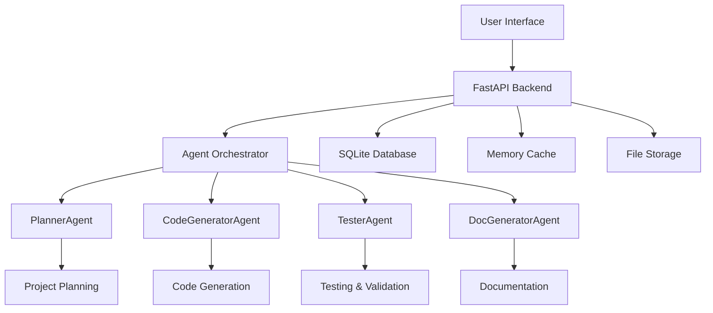

# 🤖 Multi-Agent Code Generator

**AI-powered code generation system using CrewAI multi-agent architecture**

[](https://huggingface.co/spaces)
[](https://opensource.org/licenses/MIT)
[](https://www.python.org/downloads/)

## 🌟 Overview

The Multi-Agent Code Generator is an advanced AI-powered system that creates complete software projects using a collaborative team of specialized AI agents. Built with CrewAI and powered by OpenAI's GPT models, it can generate full-stack applications, APIs, websites, and more with intelligent planning, coding, testing, and documentation.

### ✨ Key Features

- 🧠 **Multi-Agent Intelligence**: Specialized AI agents working together
- 🎯 **Project Planning**: Intelligent analysis and architecture design
- ⚡ **Code Generation**: Production-ready code in multiple languages
- 🧪 **Automated Testing**: Built-in code validation and testing
- 📚 **Documentation**: Automatic README and API documentation
- 🌐 **Web Interface**: Beautiful Persian/Farsi UI with real-time updates
- 📱 **Real-time Progress**: Live updates via WebSocket connections
- 💾 **Project Download**: Complete projects as ZIP files

## 🤖 AI Agents

Our system employs four specialized AI agents:

1. **🎯 PlannerAgent**: Analyzes requirements and creates detailed project plans
2. **⚙️ CodeGeneratorAgent**: Generates high-quality, production-ready code
3. **🧪 TesterAgent**: Creates and validates tests for reliability
4. **📖 DocGeneratorAgent**: Produces comprehensive documentation

## 🚀 Quick Start

### 1. Set Your OpenAI API Key

**Important**: You need an OpenAI API key to use this system.

- Go to [OpenAI API Keys](https://platform.openai.com/api-keys)
- Create a new API key
- Add it to the Hugging Face Spaces secrets as `OPENAI_API_KEY`

### 2. Access the Interface

Once deployed, simply:
1. Open the Hugging Face Space
2. Fill out the project requirements form
3. Click "Generate Project" 
4. Watch the AI agents work in real-time
5. Download your complete project

## 🛠️ Supported Technologies

### Programming Languages
- 🐍 Python (Flask, Django, FastAPI)
- 🟨 JavaScript/TypeScript (React, Vue, Node.js)
- 🌐 HTML/CSS (Bootstrap, Tailwind)
- ☕ Java (Spring Boot)
- 🔷 C# (.NET)
- 🐹 Go
- 💎 Ruby (Rails)
- 🐘 PHP (Laravel)

### Project Types
- 🌐 **Web Applications**: Full-stack web apps
- 🔌 **REST APIs**: RESTful service architectures
- 🖥️ **Desktop Apps**: Cross-platform applications
- 📱 **Mobile Apps**: React Native applications
- 🤖 **AI/ML Projects**: Machine learning pipelines
- 📊 **Data Analysis**: Analytics and visualization tools

### Frameworks & Libraries
- **Frontend**: React, Vue.js, Angular, Svelte
- **Backend**: FastAPI, Express.js, Django, Flask
- **Database**: PostgreSQL, MongoDB, SQLite, Redis
- **AI/ML**: TensorFlow, PyTorch, Scikit-learn
- **Styling**: Tailwind CSS, Bootstrap, Material-UI

## 📋 Usage Guide

### Basic Workflow

1. **📝 Fill Requirements**:
   - Project name and description
   - Select technology stack
   - Choose complexity level
   - Specify features

2. **🎯 AI Planning**:
   - PlannerAgent analyzes requirements
   - Creates detailed project architecture
   - Defines development phases

3. **⚙️ Code Generation**:
   - CodeGeneratorAgent creates files
   - Implements features step by step
   - Follows best practices

4. **🧪 Testing & Validation**:
   - TesterAgent creates test suites
   - Validates code functionality
   - Ensures quality standards

5. **📚 Documentation**:
   - DocGeneratorAgent writes docs
   - Creates README files
   - Generates API documentation

6. **📦 Download Project**:
   - Complete project as ZIP file
   - Ready-to-run code
   - Full documentation included

### Example Projects

**🌐 E-commerce Website**
```
Technologies: React + Node.js + MongoDB
Features: User auth, product catalog, shopping cart, payment integration
Complexity: Medium
Result: Complete e-commerce platform with admin panel
```

**🔌 REST API Service**
```
Technologies: Python + FastAPI + PostgreSQL
Features: CRUD operations, authentication, rate limiting, documentation
Complexity: Low
Result: Production-ready API with OpenAPI docs
```

**📊 Data Dashboard**
```
Technologies: Python + Streamlit + Pandas
Features: Data visualization, real-time updates, export functionality  
Complexity: Medium
Result: Interactive analytics dashboard
```

## 🏗️ Architecture



## 🔧 Technical Details

### Backend Stack
- **Framework**: FastAPI with async/await
- **Database**: SQLite with SQLAlchemy ORM
- **Cache**: Memory-based caching system
- **AI Framework**: CrewAI for agent orchestration
- **LLM**: OpenAI GPT-4 for intelligent code generation

### Frontend Features
- **Language**: Persian/Farsi with RTL support
- **Real-time**: WebSocket connections for live updates
- **Responsive**: Mobile-friendly design
- **Interactive**: Rich form controls and progress tracking

### Performance Optimizations
- **Async Operations**: Non-blocking request handling
- **Memory Management**: Efficient caching strategies
- **Rate Limiting**: Prevents API abuse
- **Resource Limits**: Controlled concurrent generations

## 🔒 Security & Privacy

- 🔐 **API Key Security**: Keys stored securely in environment variables
- 🛡️ **Input Validation**: All user inputs are validated and sanitized
- 🚫 **Rate Limiting**: Prevents abuse and ensures fair usage
- 🔒 **CORS Protection**: Secure cross-origin resource sharing
- 🗂️ **File Safety**: Generated files are sandboxed and secure

## 📊 Monitoring & Analytics

The system includes comprehensive monitoring:

- 📈 **Real-time Metrics**: Active jobs, completion rates
- 📝 **Detailed Logging**: Structured logging with timestamps
- 🔍 **Error Tracking**: Comprehensive error reporting
- 📊 **Usage Statistics**: Project generation analytics

## 🤝 Contributing

We welcome contributions! Here's how you can help:

1. **🐛 Bug Reports**: Report issues via GitHub Issues
2. **✨ Feature Requests**: Suggest new features or improvements
3. **🔧 Code Contributions**: Submit pull requests with improvements
4. **📚 Documentation**: Help improve documentation and examples

## 📄 License

This project is licensed under the MIT License - see the [LICENSE](LICENSE) file for details.

## 🙏 Acknowledgments

- **CrewAI**: For the excellent multi-agent framework
- **OpenAI**: For providing powerful language models
- **Hugging Face**: For the amazing Spaces platform
- **FastAPI**: For the high-performance web framework
- **Community**: For feedback and contributions

## 📞 Support

- 📧 **Email**: [Contact Developer]
- 💬 **GitHub**: [Open an Issue](https://github.com/your-repo/issues)
- 🤗 **Hugging Face**: [Space Discussions](https://huggingface.co/spaces)

---

<div align="center">

**🚀 Start generating amazing projects with AI today!**

Made with ❤️ by the AI community | Powered by 🤗 Hugging Face Spaces

</div>