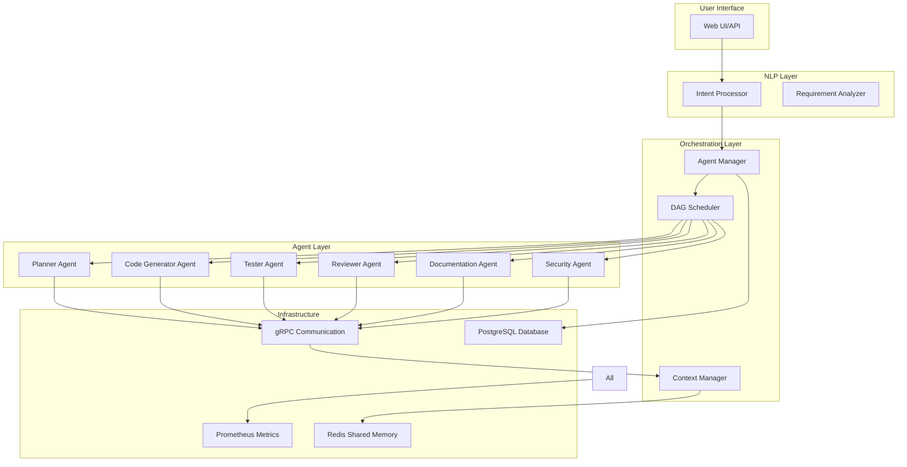

# Multi-Agent Code Generation System Architecture

## Overview

This document describes the architecture of a true collaborative multi-agent framework where AI agents intelligently interact to transform natural language requirements into complete, production-ready projects.

## System Architecture

### High-Level Architecture



## Core Components

### 1. Agent Orchestrator (`AgentManager`)

The central brain of the system that coordinates all agent activities.

**Key Features:**
- Dynamic task delegation based on agent expertise and availability
- Real-time agent health monitoring
- Priority-based task queuing
- Conflict resolution through weighted voting
- Performance tracking and optimization

**Implementation Highlights:**
```python
class AgentManager:
    async def submit_task(self, task_type, payload, priority, dependencies):
        # Dynamic routing based on task type
        # Intelligent agent selection
        # Dependency tracking
        
    def get_least_busy_agent(self, task_type):
        # Performance-based selection
        # Capability matching
        # Load balancing
```

### 2. Shared Memory System (`SharedMemoryStore`)

Redis-based distributed memory for agent collaboration.

**Features:**
- Context sharing between agents
- Intermediate result storage
- Pub/Sub for real-time updates
- TTL-based cleanup
- Multiple serialization formats

**Key Operations:**
- Store/retrieve complex data structures
- Atomic operations for consistency
- Distributed locking for coordination
- Channel-based communication

### 3. Agent Communication (gRPC)

High-performance inter-agent communication using gRPC.

**Protocol Definition:**
```protobuf
service AgentService {
    rpc ExecuteTask(TaskRequest) returns (TaskResponse);
    rpc StreamTaskProgress(TaskProgressRequest) returns (stream TaskProgressUpdate);
    rpc CollaborateRequest(CollaborationRequest) returns (CollaborationResponse);
    rpc ShareContext(ContextShareRequest) returns (ContextShareResponse);
}
```

**Benefits:**
- Lower latency than REST
- Streaming support
- Strong typing
- Built-in retry and timeout handling

### 4. Database Schema

PostgreSQL schema for persistent state management.

**Core Tables:**
- `agents`: Agent registry and status
- `agent_tasks`: Task tracking and dependencies
- `task_artifacts`: Generated outputs
- `agent_collaborations`: Inter-agent interactions
- `shared_context`: Persistent context storage

**Advanced Features:**
- Circular dependency prevention
- Materialized views for performance
- Agent performance scoring functions
- Task dependency graph tracking

### 5. Specialized Agents

#### Planner Agent
- Analyzes requirements
- Creates project structure
- Defines task dependencies
- Estimates complexity

#### Code Generator Agent
- Generates production-ready code
- Follows best practices
- Handles multiple languages/frameworks
- Integrates with external tools

#### Reviewer Agent
- Static code analysis
- Security vulnerability scanning
- Performance assessment
- Best practice validation

#### Tester Agent
- Unit test generation
- Integration testing
- Performance testing
- Test coverage analysis

#### Documentation Agent
- API documentation
- User guides
- Technical documentation
- README generation

### 6. NLP Intent Processor

Advanced NLP for requirement extraction.

**Features:**
- Zero-shot classification
- Named entity recognition
- Technology stack detection
- Feature prioritization
- Constraint extraction

**Output Structure:**
```json
{
    "project_type": "web_app",
    "features": [
        {
            "name": "user_authentication",
            "type": "security",
            "priority": "p0",
            "acceptance_criteria": [...]
        }
    ],
    "tech_stack": {
        "frontend": ["react", "tailwind"],
        "backend": ["fastapi", "postgresql"]
    },
    "constraints": {
        "performance": ["handle 1000 concurrent users"],
        "security": ["OAuth2 authentication"]
    }
}
```

### 7. DAG Scheduler

Optimizes parallel execution of independent tasks.

**Features:**
- Dependency graph analysis
- Critical path calculation
- Dynamic task prioritization
- Resource pool management
- Failure recovery strategies

**Execution Flow:**
1. Build task dependency graph
2. Identify parallelizable tasks
3. Calculate critical path
4. Execute tasks in optimal order
5. Handle failures gracefully

## Agent Collaboration Patterns

### 1. Sequential Collaboration
```
Planner → Code Generator → Tester → Reviewer
```

### 2. Parallel Collaboration
```
         ┌→ Frontend Developer
Planner →┼→ Backend Developer
         └→ Database Designer
```

### 3. Iterative Collaboration
```
Code Generator ↔ Reviewer (until quality threshold met)
```

### 4. Consensus-Based Decision Making
```
Multiple Agents → Voting → Conflict Resolution → Final Decision
```

## Quality Control & Self-Improvement

### Validation Pipeline
1. **Syntax Validation**: AST-based analysis
2. **Security Scanning**: OWASP Top 10 checks
3. **Performance Analysis**: Complexity metrics
4. **Best Practice Check**: Language-specific rules
5. **Dependency Audit**: Vulnerability scanning

### Feedback Loops
- Agent decision logging
- Performance metric tracking
- Error pattern analysis
- Continuous improvement through metrics

## Performance Optimization

### Parallel Execution
- DAG-based task scheduling
- Resource pool management
- Speculative execution
- Task batching

### Caching Strategy
- Redis-based result caching
- Vector database for similar queries
- Intermediate result storage
- TTL-based expiration

### Metrics & Monitoring
- Prometheus metrics integration
- Real-time performance tracking
- Agent utilization monitoring
- Task duration analysis

## API Endpoints

### Agent Management
- `POST /api/agents/register` - Register new agent
- `GET /api/agents/status` - Get agent status
- `DELETE /api/agents/{agent_id}` - Unregister agent

### Task Management
- `POST /api/tasks/submit` - Submit new task
- `GET /api/tasks/{task_id}/status` - Get task status
- `POST /api/tasks/{task_id}/cancel` - Cancel task

### Project Generation
- `POST /api/projects/generate` - Generate new project
- `GET /api/projects/{project_id}/progress` - Get generation progress
- `GET /api/projects/{project_id}/artifacts` - Download artifacts

## Deployment Architecture

### Kubernetes Deployment
```yaml
apiVersion: apps/v1
kind: Deployment
metadata:
  name: agent-orchestrator
spec:
  replicas: 3
  selector:
    matchLabels:
      app: agent-orchestrator
  template:
    spec:
      containers:
      - name: orchestrator
        image: multi-agent-system:latest
        ports:
        - containerPort: 8000  # API
        - containerPort: 50051 # gRPC
```

### Service Mesh Integration
- Istio for service discovery
- Automatic load balancing
- Circuit breaking
- Distributed tracing

## Security Considerations

### Authentication & Authorization
- JWT-based authentication
- Role-based access control
- Agent-specific permissions
- API key management

### Data Security
- Encryption at rest (PostgreSQL)
- Encryption in transit (TLS)
- Secure key storage
- Input sanitization

### Agent Security
- Sandboxed execution environments
- Resource limits
- Code execution validation
- Dependency scanning

## Rollout Plan

### Phase 1: Foundation (Weeks 1-2)
- Deploy core orchestrator
- Setup Redis and PostgreSQL
- Implement basic agents
- Create monitoring dashboard

### Phase 2: Agent Enhancement (Weeks 3-4)
- Add specialized agents
- Implement gRPC communication
- Enable parallel execution
- Add quality validation

### Phase 3: Advanced Features (Weeks 5-6)
- NLP intent processing
- DAG scheduling
- Performance optimization
- Production hardening

### Phase 4: Scale & Monitor (Weeks 7-8)
- Kubernetes deployment
- Load testing
- Performance tuning
- Documentation completion

## Code Examples

### Task Submission
```python
async def submit_project_generation(user_request: str):
    # 1. NLP Processing
    intent = await intent_processor.process_requirements(user_request)
    
    # 2. Create task DAG
    tasks = []
    
    # Planning task
    tasks.append({
        'task_id': 'plan_001',
        'task_type': 'project_planning',
        'agent_type': 'planner',
        'payload': intent.to_dict(),
        'priority': 1
    })
    
    # Code generation tasks (dependent on planning)
    for feature in intent.features:
        tasks.append({
            'task_id': f'code_{feature.name}',
            'task_type': 'code_generation',
            'dependencies': ['plan_001'],
            'payload': {'feature': feature},
            'priority': feature.priority
        })
    
    # Create and execute DAG
    dag_id = await scheduler.create_dag('project_001', tasks)
    results = await scheduler.execute_dag(dag_id)
    
    return results
```

### Agent Collaboration
```python
async def collaborative_code_review(code_artifact):
    # Developer agent generates code
    code_result = await agent_manager.submit_task(
        task_type='code_generation',
        payload={'spec': code_artifact['spec']},
        priority=TaskPriority.HIGH
    )
    
    # Reviewer agent reviews code
    review_result = await agent_manager.submit_task(
        task_type='code_review',
        payload={'code': code_result['code']},
        priority=TaskPriority.HIGH,
        context_keys=['code_quality_threshold']
    )
    
    # If review fails, iterate
    if not review_result['passed']:
        # Trigger enhancement
        enhanced_code = await agent_manager.submit_task(
            task_type='code_enhancement',
            payload={
                'code': code_result['code'],
                'feedback': review_result['feedback']
            }
        )
    
    return enhanced_code
```

## Monitoring & Observability

### Key Metrics
- **Task Throughput**: Tasks completed per minute
- **Agent Utilization**: Percentage of busy agents
- **Task Duration**: Average completion time by type
- **Error Rate**: Failed tasks percentage
- **Queue Depth**: Pending tasks count

### Dashboards
- Real-time agent status
- Task execution timeline
- Performance trends
- Error analysis
- Resource utilization

## Future Enhancements

### Short Term
- Add more specialized agents (Mobile, DevOps, Data)
- Implement agent learning from feedback
- Enhanced caching strategies
- Better error recovery

### Long Term
- Multi-language support
- Visual programming interface
- Agent marketplace
- Automated agent creation
- Federated learning across deployments

## Conclusion

This multi-agent system represents a significant advancement in AI-powered code generation, moving from isolated tools to a truly collaborative framework. The architecture balances sophistication with reliability, enabling complex project generation while maintaining quality and performance.