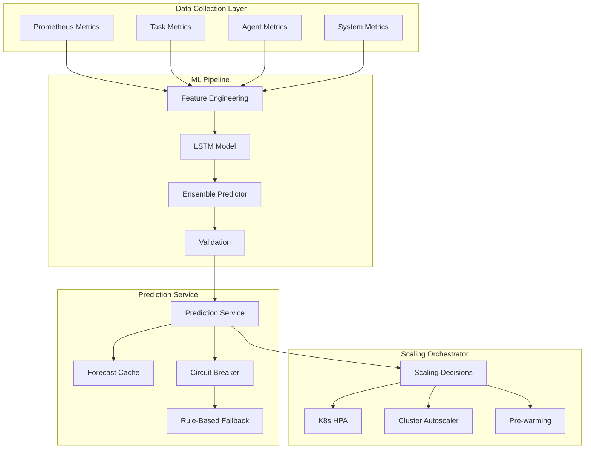

# AI-Powered Predictive Scaling Architecture

## System Overview



## Component Design

### 1. Data Collection & Feature Engineering

```python
# predictive_scaling/features.py
from dataclasses import dataclass
from typing import List, Dict, Optional
import numpy as np
from datetime import datetime, timedelta

@dataclass
class ScalingFeatures:
    """Features for predictive scaling model"""
    # Time-based features
    hour_of_day: int
    day_of_week: int
    day_of_month: int
    is_weekend: bool
    is_holiday: bool
    
    # Historical metrics (rolling windows)
    task_rate_1m: float
    task_rate_5m: float
    task_rate_15m: float
    task_rate_1h: float
    
    # Queue metrics
    queue_depth_by_priority: Dict[str, int]
    avg_queue_time: float
    queue_growth_rate: float
    
    # Agent utilization
    agent_utilization_by_type: Dict[str, float]
    active_agents_by_type: Dict[str, int]
    avg_task_duration_by_type: Dict[str, float]
    
    # Task complexity
    complexity_distribution: Dict[str, float]
    dependency_ratio: float
    
    # System metrics
    cpu_usage: float
    memory_usage: float
    network_throughput: float
    
    # External factors
    api_request_rate: float
    user_sessions_active: int
    
    # Derived features
    task_acceleration: float  # Rate of change in task submission
    utilization_pressure: float  # How close to capacity
    cost_efficiency: float  # Tasks per dollar

class FeatureExtractor:
    """Extract features from Prometheus metrics"""
    
    def __init__(self, prometheus_client):
        self.prom = prometheus_client
        self.feature_window = timedelta(hours=2)
        
    async def extract_features(self, timestamp: datetime) -> ScalingFeatures:
        """Extract features for a given timestamp"""
        # Time-based features
        hour_of_day = timestamp.hour
        day_of_week = timestamp.weekday()
        day_of_month = timestamp.day
        is_weekend = day_of_week >= 5
        is_holiday = self._check_holiday(timestamp)
        
        # Query Prometheus for metrics
        end_time = timestamp
        start_time = timestamp - self.feature_window
        
        # Task rates
        task_rate_1m = await self._query_rate('agent_tasks_submitted_total', 1)
        task_rate_5m = await self._query_rate('agent_tasks_submitted_total', 5)
        task_rate_15m = await self._query_rate('agent_tasks_submitted_total', 15)
        task_rate_1h = await self._query_rate('agent_tasks_submitted_total', 60)
        
        # Queue metrics
        queue_depth = await self._query_instant('task_queue_depth')
        queue_depth_by_priority = self._group_by_label(queue_depth, 'priority')
        
        avg_queue_time = await self._query_avg('task_queue_duration_seconds', 5)
        queue_growth_rate = await self._calculate_growth_rate('task_queue_depth', 5)
        
        # Agent utilization
        utilization = await self._query_instant('agent_utilization_ratio')
        agent_utilization_by_type = self._group_by_label(utilization, 'agent_type')
        
        active_agents = await self._query_instant('agent_pool_size')
        active_agents_by_type = self._group_by_label(active_agents, 'agent_type')
        
        # Task complexity
        complexity_dist = await self._get_complexity_distribution()
        dependency_ratio = await self._get_dependency_ratio()
        
        # Derived features
        task_acceleration = self._calculate_acceleration(
            [task_rate_1m, task_rate_5m, task_rate_15m, task_rate_1h]
        )
        
        utilization_pressure = self._calculate_pressure(agent_utilization_by_type)
        cost_efficiency = await self._calculate_cost_efficiency()
        
        return ScalingFeatures(
            hour_of_day=hour_of_day,
            day_of_week=day_of_week,
            day_of_month=day_of_month,
            is_weekend=is_weekend,
            is_holiday=is_holiday,
            task_rate_1m=task_rate_1m,
            task_rate_5m=task_rate_5m,
            task_rate_15m=task_rate_15m,
            task_rate_1h=task_rate_1h,
            queue_depth_by_priority=queue_depth_by_priority,
            avg_queue_time=avg_queue_time,
            queue_growth_rate=queue_growth_rate,
            agent_utilization_by_type=agent_utilization_by_type,
            active_agents_by_type=active_agents_by_type,
            avg_task_duration_by_type=await self._get_avg_duration_by_type(),
            complexity_distribution=complexity_dist,
            dependency_ratio=dependency_ratio,
            cpu_usage=await self._query_avg('node_cpu_usage', 5),
            memory_usage=await self._query_avg('node_memory_usage', 5),
            network_throughput=await self._query_rate('node_network_bytes', 5),
            api_request_rate=await self._query_rate('http_requests_total', 5),
            user_sessions_active=await self._query_instant_sum('user_sessions_active'),
            task_acceleration=task_acceleration,
            utilization_pressure=utilization_pressure,
            cost_efficiency=cost_efficiency
        )
```

### 2. LSTM Prediction Model

```python
# predictive_scaling/model.py
import torch
import torch.nn as nn
from torch.utils.data import Dataset, DataLoader
import numpy as np
from typing import Tuple, List, Dict

class WorkloadPredictor(nn.Module):
    """LSTM model for workload prediction"""
    
    def __init__(self, 
                 input_dim: int = 50,
                 hidden_dim: int = 128,
                 num_layers: int = 3,
                 output_horizons: List[int] = [15, 30, 60],  # minutes
                 dropout: float = 0.2):
        super().__init__()
        
        self.input_dim = input_dim
        self.hidden_dim = hidden_dim
        self.num_layers = num_layers
        self.output_horizons = output_horizons
        
        # LSTM layers
        self.lstm = nn.LSTM(
            input_size=input_dim,
            hidden_size=hidden_dim,
            num_layers=num_layers,
            batch_first=True,
            dropout=dropout,
            bidirectional=True
        )
        
        # Attention mechanism
        self.attention = nn.MultiheadAttention(
            embed_dim=hidden_dim * 2,
            num_heads=8,
            dropout=dropout
        )
        
        # Output heads for different horizons
        self.output_heads = nn.ModuleDict({
            f"horizon_{h}": nn.Sequential(
                nn.Linear(hidden_dim * 2, hidden_dim),
                nn.ReLU(),
                nn.Dropout(dropout),
                nn.Linear(hidden_dim, hidden_dim // 2),
                nn.ReLU(),
                nn.Linear(hidden_dim // 2, 5)  # Predict for 5 agent types
            ) for h in output_horizons
        })
        
        # Confidence estimation
        self.confidence_head = nn.Sequential(
            nn.Linear(hidden_dim * 2, 64),
            nn.ReLU(),
            nn.Linear(64, len(output_horizons)),
            nn.Sigmoid()
        )
        
    def forward(self, x: torch.Tensor, return_attention=False) -> Dict[str, torch.Tensor]:
        """
        Forward pass
        Args:
            x: Input tensor [batch_size, seq_len, input_dim]
        Returns:
            Dictionary with predictions and confidence scores
        """
        batch_size = x.size(0)
        
        # LSTM encoding
        lstm_out, (h_n, c_n) = self.lstm(x)
        
        # Apply attention
        attn_out, attn_weights = self.attention(
            lstm_out, lstm_out, lstm_out
        )
        
        # Global context from last hidden state
        context = torch.cat([h_n[-2], h_n[-1]], dim=1)  # Bidirectional
        
        # Predictions for each horizon
        predictions = {}
        for horizon in self.output_horizons:
            key = f"horizon_{horizon}"
            predictions[key] = self.output_heads[key](context)
        
        # Confidence scores
        confidence = self.confidence_head(context)
        
        output = {
            'predictions': predictions,
            'confidence': confidence
        }
        
        if return_attention:
            output['attention_weights'] = attn_weights
            
        return output


class PredictiveScalingEngine:
    """Main engine for predictive scaling"""
    
    def __init__(self, model_path: str, feature_extractor: FeatureExtractor):
        self.model = self._load_model(model_path)
        self.feature_extractor = feature_extractor
        self.prediction_cache = {}
        self.confidence_threshold = 0.8
        
    async def predict_workload(self, 
                              timestamp: datetime,
                              horizons: List[int] = [15, 30, 60]) -> Dict[str, Any]:
        """
        Predict future workload
        Returns:
            {
                'predictions': {
                    '15min': {'planner': 10, 'code_generator': 25, ...},
                    '30min': {...},
                    '60min': {...}
                },
                'confidence': {
                    '15min': 0.92,
                    '30min': 0.85,
                    '60min': 0.78
                },
                'features': {...},
                'fallback_triggered': False
            }
        """
        # Extract features
        features = await self.feature_extractor.extract_features(timestamp)
        
        # Prepare input tensor
        input_tensor = self._prepare_input(features)
        
        # Get predictions
        with torch.no_grad():
            output = self.model(input_tensor)
        
        # Process predictions
        predictions = self._process_predictions(output['predictions'])
        confidence = output['confidence'].squeeze().tolist()
        
        # Check confidence threshold
        use_fallback = any(c < self.confidence_threshold for c in confidence)
        
        if use_fallback:
            # Blend with rule-based predictions
            rule_based = self._rule_based_prediction(features)
            predictions = self._blend_predictions(predictions, rule_based, confidence)
        
        return {
            'predictions': predictions,
            'confidence': dict(zip([f"{h}min" for h in horizons], confidence)),
            'features': features,
            'fallback_triggered': use_fallback
        }
    
    def _rule_based_prediction(self, features: ScalingFeatures) -> Dict[str, Dict[str, int]]:
        """Fallback rule-based prediction"""
        # Simple rules based on current metrics
        predictions = {}
        
        for horizon in [15, 30, 60]:
            horizon_key = f"{horizon}min"
            predictions[horizon_key] = {}
            
            # Calculate growth factor based on acceleration
            growth_factor = 1.0 + (features.task_acceleration * horizon / 60)
            
            # Predict for each agent type
            for agent_type, current_count in features.active_agents_by_type.items():
                utilization = features.agent_utilization_by_type.get(agent_type, 0)
                
                # Simple linear projection
                if utilization > 0.8:
                    predicted = int(current_count * growth_factor * 1.2)
                elif utilization > 0.6:
                    predicted = int(current_count * growth_factor)
                else:
                    predicted = max(2, int(current_count * 0.9))  # Scale down
                
                predictions[horizon_key][agent_type] = predicted
        
        return predictions
```

### 3. Scaling Decision Engine

```python
# predictive_scaling/scaler.py
from dataclasses import dataclass
from typing import Dict, List, Optional
import asyncio
from datetime import datetime, timedelta

@dataclass
class ScalingDecision:
    """Represents a scaling decision"""
    timestamp: datetime
    agent_type: str
    current_count: int
    target_count: int
    confidence: float
    reason: str
    apply_at: datetime
    
@dataclass
class ScalingConstraints:
    """Constraints for scaling decisions"""
    min_agents: Dict[str, int]
    max_agents: Dict[str, int]
    scale_up_rate: int
    scale_down_rate: int
    cooldown_seconds: int
    cost_limit_per_hour: float
    spot_instance_ratio: float = 0.7

class PredictiveScaler:
    """Makes scaling decisions based on predictions"""
    
    def __init__(self, 
                 prediction_engine: PredictiveScalingEngine,
                 constraints: ScalingConstraints,
                 k8s_client):
        self.prediction_engine = prediction_engine
        self.constraints = constraints
        self.k8s_client = k8s_client
        self.last_scaling_decision = {}
        self.scaling_history = []
        
    async def run_scaling_loop(self):
        """Main scaling loop"""
        while True:
            try:
                # Get predictions
                now = datetime.utcnow()
                predictions = await self.prediction_engine.predict_workload(now)
                
                # Make scaling decisions
                decisions = self._make_scaling_decisions(predictions, now)
                
                # Apply decisions
                for decision in decisions:
                    if self._should_apply_decision(decision):
                        await self._apply_scaling_decision(decision)
                        self.scaling_history.append(decision)
                
                # Schedule pre-warming for future peaks
                await self._schedule_pre_warming(predictions)
                
                # Wait before next iteration
                await asyncio.sleep(30)  # Check every 30 seconds
                
            except Exception as e:
                logger.error(f"Error in scaling loop: {e}")
                await asyncio.sleep(60)
    
    def _make_scaling_decisions(self, 
                               predictions: Dict[str, Any],
                               timestamp: datetime) -> List[ScalingDecision]:
        """Convert predictions to scaling decisions"""
        decisions = []
        
        # Use 15-minute prediction for immediate scaling
        prediction_15min = predictions['predictions']['15min']
        confidence_15min = predictions['confidence']['15min']
        
        for agent_type, target_count in prediction_15min.items():
            current_count = self._get_current_agent_count(agent_type)
            
            # Check if scaling is needed
            if target_count != current_count:
                # Apply constraints
                target_count = self._apply_constraints(
                    agent_type, current_count, target_count
                )
                
                # Check cooldown
                if self._check_cooldown(agent_type, timestamp):
                    decision = ScalingDecision(
                        timestamp=timestamp,
                        agent_type=agent_type,
                        current_count=current_count,
                        target_count=target_count,
                        confidence=confidence_15min,
                        reason=self._get_scaling_reason(predictions['features']),
                        apply_at=timestamp + timedelta(seconds=5)
                    )
                    decisions.append(decision)
        
        return decisions
    
    async def _apply_scaling_decision(self, decision: ScalingDecision):
        """Apply scaling decision to Kubernetes"""
        logger.info(f"Applying scaling decision: {decision}")
        
        # Update HPA target
        await self.k8s_client.patch_hpa(
            name=f"{decision.agent_type}-agent-hpa",
            namespace="agent-orchestrator",
            target_replicas=decision.target_count
        )
        
        # Update metrics for Prometheus
        scaling_decisions_total.labels(
            agent_type=decision.agent_type,
            direction="up" if decision.target_count > decision.current_count else "down"
        ).inc()
        
        # Record decision
        self.last_scaling_decision[decision.agent_type] = decision.timestamp
    
    async def _schedule_pre_warming(self, predictions: Dict[str, Any]):
        """Schedule pre-warming of agents for predicted peaks"""
        # Look at 30 and 60 minute predictions
        for horizon in ['30min', '60min']:
            prediction = predictions['predictions'][horizon]
            confidence = predictions['confidence'][horizon]
            
            if confidence > 0.85:  # High confidence
                for agent_type, target_count in prediction.items():
                    current = self._get_current_agent_count(agent_type)
                    
                    # If significant increase predicted
                    if target_count > current * 1.3:
                        # Schedule gradual pre-warming
                        await self._schedule_gradual_scaling(
                            agent_type, current, target_count, 
                            horizon_minutes=int(horizon.replace('min', ''))
                        )
```

### 4. Integration with Kubernetes HPA

```yaml
# predictive_scaling/k8s/predictive-hpa.yaml
apiVersion: v1
kind: ConfigMap
metadata:
  name: predictive-scaling-config
  namespace: agent-orchestrator
data:
  config.yaml: |
    model:
      path: /models/workload_predictor_v1.pth
      confidence_threshold: 0.8
      horizons: [15, 30, 60]
    
    constraints:
      min_agents:
        planner: 2
        code_generator: 3
        tester: 2
        reviewer: 1
        doc_generator: 1
      max_agents:
        planner: 50
        code_generator: 150
        tester: 80
        reviewer: 30
        doc_generator: 20
      scale_up_rate: 5
      scale_down_rate: 2
      cooldown_seconds: 120
      cost_limit_per_hour: 1500.0
    
    fallback:
      enabled: true
      rules:
        - condition: "queue_depth > 100"
          action: "scale_up"
          factor: 1.5
        - condition: "utilization < 0.3"
          action: "scale_down"
          factor: 0.7
---
apiVersion: apps/v1
kind: Deployment
metadata:
  name: predictive-scaler
  namespace: agent-orchestrator
spec:
  replicas: 2  # HA setup
  selector:
    matchLabels:
      app: predictive-scaler
  template:
    metadata:
      labels:
        app: predictive-scaler
    spec:
      serviceAccountName: predictive-scaler
      containers:
      - name: scaler
        image: agent-orchestrator/predictive-scaler:latest
        env:
        - name: PROMETHEUS_URL
          value: "http://prometheus:9090"
        - name: MODEL_UPDATE_INTERVAL
          value: "3600"  # Update model every hour
        - name: ENABLE_PROFILING
          value: "true"
        resources:
          requests:
            cpu: 500m
            memory: 2Gi
          limits:
            cpu: 2
            memory: 4Gi
        volumeMounts:
        - name: models
          mountPath: /models
        - name: config
          mountPath: /config
      volumes:
      - name: models
        persistentVolumeClaim:
          claimName: ml-models-pvc
      - name: config
        configMap:
          name: predictive-scaling-config
---
# Custom Resource for Predictive HPA
apiVersion: apiextensions.k8s.io/v1
kind: CustomResourceDefinition
metadata:
  name: predictivehpas.autoscaling.agent-orchestrator.io
spec:
  group: autoscaling.agent-orchestrator.io
  versions:
  - name: v1alpha1
    served: true
    storage: true
    schema:
      openAPIV3Schema:
        type: object
        properties:
          spec:
            type: object
            properties:
              scaleTargetRef:
                type: object
              predictiveConfig:
                type: object
                properties:
                  horizons:
                    type: array
                    items:
                      type: integer
                  confidenceThreshold:
                    type: number
                  fallbackEnabled:
                    type: boolean
          status:
            type: object
  scope: Namespaced
  names:
    plural: predictivehpas
    singular: predictivehpa
    kind: PredictiveHPA
```

### 5. Training Pipeline

```python
# predictive_scaling/training/pipeline.py
import torch
from torch.utils.data import DataLoader
import mlflow
from datetime import datetime, timedelta
import pandas as pd

class ModelTrainingPipeline:
    """Automated training pipeline for predictive scaling model"""
    
    def __init__(self, prometheus_url: str, s3_bucket: str):
        self.prometheus_url = prometheus_url
        self.s3_bucket = s3_bucket
        self.mlflow_tracking_uri = "http://mlflow:5000"
        
    async def run_training_pipeline(self):
        """Run complete training pipeline"""
        mlflow.set_tracking_uri(self.mlflow_tracking_uri)
        
        with mlflow.start_run():
            # 1. Data collection
            logger.info("Collecting training data...")
            train_data, val_data = await self._collect_training_data()
            mlflow.log_metric("train_samples", len(train_data))
            mlflow.log_metric("val_samples", len(val_data))
            
            # 2. Feature engineering
            logger.info("Engineering features...")
            train_dataset = await self._prepare_dataset(train_data)
            val_dataset = await self._prepare_dataset(val_data)
            
            # 3. Model training
            logger.info("Training model...")
            model = WorkloadPredictor()
            trained_model, metrics = await self._train_model(
                model, train_dataset, val_dataset
            )
            
            # 4. Model evaluation
            logger.info("Evaluating model...")
            eval_metrics = await self._evaluate_model(trained_model, val_dataset)
            
            # Log metrics
            for metric_name, value in eval_metrics.items():
                mlflow.log_metric(metric_name, value)
            
            # 5. Model validation
            if eval_metrics['mae_15min'] < 2.0:  # Acceptable error threshold
                # Save model
                model_path = f"models/predictor_v{datetime.now().strftime('%Y%m%d_%H%M%S')}.pth"
                torch.save(trained_model.state_dict(), model_path)
                
                # Upload to S3
                await self._upload_model_to_s3(model_path)
                
                # Register in MLflow
                mlflow.pytorch.log_model(trained_model, "model")
                
                logger.info(f"Model training successful. MAE: {eval_metrics['mae_15min']}")
            else:
                logger.warning(f"Model performance below threshold. MAE: {eval_metrics['mae_15min']}")
    
    async def _collect_training_data(self, days: int = 90):
        """Collect historical data from Prometheus"""
        end_time = datetime.utcnow()
        start_time = end_time - timedelta(days=days)
        
        # Query metrics at 1-minute intervals
        queries = {
            'task_rate': 'rate(agent_tasks_submitted_total[5m])',
            'queue_depth': 'task_queue_depth',
            'agent_utilization': 'agent_utilization_ratio',
            'task_duration': 'histogram_quantile(0.95, agent_task_duration_seconds_bucket)',
            'agent_count': 'agent_pool_size'
        }
        
        data = {}
        for metric_name, query in queries.items():
            result = await self._query_range(query, start_time, end_time, step=60)
            data[metric_name] = result
        
        # Split into train/val
        split_point = int(len(data['task_rate']) * 0.8)
        train_data = {k: v[:split_point] for k, v in data.items()}
        val_data = {k: v[split_point:] for k, v in data.items()}
        
        return train_data, val_data
```

## Implementation Roadmap

### Phase 1: Foundation (Weeks 1-2)
1. Set up ML infrastructure
   - Deploy MLflow for experiment tracking
   - Set up model storage (S3/GCS)
   - Configure training compute resources
2. Implement feature extraction pipeline
   - Connect to Prometheus
   - Build feature engineering module
   - Create training data collection

### Phase 2: Model Development (Weeks 2-3)
1. Develop LSTM model architecture
   - Implement attention mechanism
   - Add confidence estimation
   - Create ensemble predictor
2. Build training pipeline
   - Automated data collection
   - Hyperparameter tuning
   - Model evaluation

### Phase 3: Integration (Weeks 3-4)
1. Create prediction service
   - Real-time feature extraction
   - Model serving with caching
   - Fallback mechanisms
2. Integrate with Kubernetes
   - Custom HPA controller
   - Prometheus metrics export
   - Gradual rollout with feature flags

### Phase 4: Monitoring & Optimization (Week 4+)
1. Set up monitoring
   - Prediction accuracy tracking
   - Cost savings dashboard
   - Model drift detection
2. Continuous improvement
   - A/B testing framework
   - Automated retraining
   - Performance optimization

## Success Metrics

1. **Prediction Accuracy**
   - MAE < 2 agents for 15-minute predictions
   - MAE < 5 agents for 60-minute predictions
   - Confidence calibration error < 10%

2. **Cost Reduction**
   - 35-40% reduction in over-provisioning costs
   - 25% increase in spot instance usage
   - <5% SLA violations due to under-provisioning

3. **Performance Impact**
   - Scaling decision latency < 100ms
   - Pre-warming success rate > 90%
   - Queue depth spike reduction > 50%

## Risk Mitigation

1. **Model Failure**
   - Automatic fallback to rule-based scaling
   - Circuit breaker with exponential backoff
   - Manual override capabilities

2. **Data Quality Issues**
   - Anomaly detection on input features
   - Data validation pipelines
   - Metric reconciliation checks

3. **Cost Overruns**
   - Hard cost limits in scaling decisions
   - Budget alerts and automatic throttling
   - Gradual rollout with cost monitoring